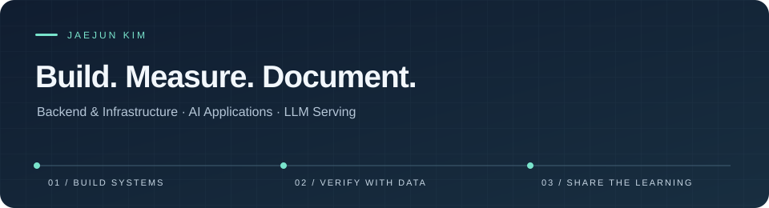

  

  <a href="https://muscleleg.github.io/jaejun-wiki/">재준위키</a>
  &nbsp; · &nbsp;
  <a href="https://muscleleg.github.io/jaejun-wiki/projects.html">프로젝트 자세히 보기</a>

### 안녕하세요, 김재준입니다.

백엔드와 인프라를 공부하며 쌓은 경험을 **AI 애플리케이션과 LLM 서빙**으로 확장하고 있습니다.
직접 구현하고, 실행 결과로 확인하고, 다시 활용할 수 있는 기록으로 남기는 과정을 좋아합니다.

- **만듭니다.** 문서를 활용하는 RAG 서비스, Kubernetes 관측 도구, 개인 학습 관리 CLI를 구현했습니다.
- **확인합니다.** 모델의 출력과 서빙 동작을 평가 코드·측정값·Trace로 살펴봅니다.
- **기록합니다.** 설계 이유, 막힌 지점, 실험 결과를 [재준위키](https://muscleleg.github.io/jaejun-wiki/)에 연결해 둡니다.

### Selected projects

| 프로젝트 | 구현하고 확인한 것 |
| :--- | :--- |
| **[JWiki CLI](https://muscleleg.github.io/jaejun-wiki/wiki/projects/adaptive-learning-coach.html)** 개인 학습·기록 관리 | LLM과의 대화로 학습 계획과 근거를 관리하고, Markdown·학습 데이터를 위키와 포트폴리오로 생성합니다. Node.js · JavaScript · Markdown · JSON Schema |
| **[Kubernetes Function Calling](https://muscleleg.github.io/jaejun-wiki/wiki/projects/ko-k8s-function-calling.html)** 소형 LLM 파인튜닝·평가 | Qwen3-1.7B를 LoRA로 학습해 한국어 요청을 조회 함수와 인자로 변환했습니다. **동일 holdout의 전체 성공률 36% → 96%**를 확인했습니다. Qwen3 · LoRA · vLLM · 조회 도구 5개로 한정한 출력 평가 |
| **[Kubernetes 운영 관측 AI](https://muscleleg.github.io/jaejun-wiki/wiki/projects/kubernetes-ai-observability.html)** 운영 신호와 해석 연결 | Pod의 Metrics·Logs·Events를 수집하고, 관측 사실과 해석·근거를 구분하는 AI Summary로 연결했습니다. Kubernetes · FastAPI · Observability |
| **[Notion RAG 개인 지식 비서](https://muscleleg.github.io/jaejun-wiki/wiki/projects/notion-rag-knowledge-assistant.html)** 문서 검색부터 복습까지 | Notion 문서 수집·임베딩, 출처 기반 스트리밍 답변, 퀴즈·채점·학습 이력을 하나의 서비스로 연결했습니다. Next.js · FastAPI · PostgreSQL · Qdrant |

### Exploring LLM serving

Transformer의 Attention과 생성 루프를 직접 구현하는 데서 시작해, **vLLM이 요청과 GPU 메모리를 다루는 방식**을 실험하고 있습니다.

- [**KV Cache Block의 할당·증가·반환·재사용**](https://muscleleg.github.io/jaejun-wiki/wiki/llm-systems/03_kv_cache_lifecycle_memory_validation.html) 모델 구조로 계산한 메모리 크기와 요청별 Scheduler Trace를 비교했습니다.
- [**Prefix Caching의 재사용 효과**](https://muscleleg.github.io/jaejun-wiki/wiki/llm-systems/vllm_prefix_caching_validation.html) OFF·ON 조건에서 60개 요청을 측정하고 Cached Token·TTFT·Latency를 함께 살펴봤습니다.

### Tools I work with

| 분야 | 프로젝트·학습에 사용한 도구 |
| :--- | :--- |
| AI & Data | Python · PyTorch · Transformers · vLLM · Qdrant |
| Backend | Java · Spring Boot · JPA · FastAPI · PostgreSQL |
| Infrastructure | Linux · Kubernetes · OpenStack · Git |
| Web & Tooling | JavaScript · TypeScript · React · Next.js · Node.js |

---

  배운 내용을 다음 구현의 출발점으로 남깁니다. 
  <a href="https://muscleleg.github.io/jaejun-wiki/"><strong>Explore Jaejun Wiki →</strong></a>

